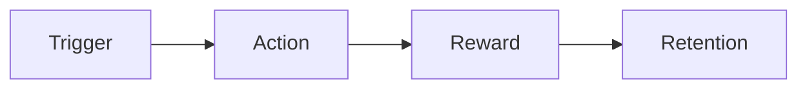

# MVP Build Prompt Generator

Synthesize completed research into a **single, executable build prompt** for a separate development workspace. This skill is the handoff step after brainstorming and market research — it turns planning artifacts into something a build agent can implement as a POC.

> **CRITICAL:** Do not write production code in this repo. Read project artifacts, apply MVP discipline, and write one prompt file at the project root. The build happens elsewhere.

## When to Use

- Research and brainstorming are done; the user wants to **validate the idea with a POC**
- The user says "generate the MVP prompt," "ready to build," or "deploy the build brief"
- A project has `README.md`, `research/`, and/or `prompts/` but no lean executable prompt yet
- Scope has crept — you need to **cut back to 3 features** and a clear value loop

## Relationship to Other Skills

| Phase | Skill | Output |
|-------|-------|--------|
| Brainstorm & research | `saas-brainstorm` | `README.md`, `research/*.md`, `prompts/*.md` |
| **MVP prompt (this skill)** | `mvp-prompt` | `<project>/MVP-BUILD-PROMPT.md` |
| Implementation | *(separate workspace)* | Working POC |

Do not duplicate deep market research here. Extract only what affects build scope and UX decisions.

---

## Scope Rules

1. **Directory isolation:** Work only inside the active project folder (e.g., `openPortfolio/`). Do not read sibling project folders unless the user explicitly asks.
2. **Root exceptions:** You may read repo-root files (`agents.md`, root `README.md`) for global constraints.
3. **Read everything first:** Before writing, read:
   - `<project>/README.md`
   - All files in `<project>/research/`
   - All files in `<project>/prompts/`
4. **One output file:** Write the final prompt to `<project>/MVP-BUILD-PROMPT.md` (project root, not `prompts/`).
5. **Update README:** Add a link to `MVP-BUILD-PROMPT.md` in the project `README.md` under a **"Build Prompt"** or **"Ready to Build"** section.

---

## Workflow

### Step 1: Extract the Core Value Loop

From existing artifacts, define the loop in one sentence, then expand:

```
[User type] does [trigger action] → gets [immediate reward] → which leads to [retention/repeat behavior]
```

**Example (openPortfolio):**
> A family helper sets up a gallery in minutes → the artist shares a beautiful link → visitors inquire → the helper gets notified and the artist feels proud → the artist adds more work.

Identify:
- **Who** experiences value first (primary user)
- **The "aha" moment** — what must work in the first session
- **What proves the idea** — the single behavior that validates the concept

If artifacts describe multiple ideas (A, B, C…), **pick one path** for the POC. State which path and why in the prompt.

---

### Step 2: Select Exactly 3 Core Features

**Hard rule:** The MVP prompt may include **at most 3 core features**. Everything else goes to Nice-to-Have.

Each core feature must:
1. Directly serve the value loop (not "nice admin tooling")
2. Be demonstrable in a POC session
3. Be buildable without Phase 2 dependencies (payments, custom domains, AI pipelines, etc.)

#### Feature selection matrix

| Candidate feature | Serves value loop? | POC-demoable? | No Phase 2 deps? | Core? |
|-------------------|-------------------|---------------|------------------|-------|
| ... | Yes/No | Yes/No | Yes/No | ✓ or defer |

**Cut aggressively.** If the README lists 6+ Phase 1 items, rank by value-loop impact and keep the top 3. Document what was cut and why.

#### Typical core feature patterns

| Product type | Feature 1 | Feature 2 | Feature 3 |
|--------------|-----------|-----------|-----------|
| Showcase/gallery | Create/publish content | Public shareable view | Visitor action (inquire, save, follow) |
| Marketplace | List item | Browse/discover | Contact or simple transaction |
| Productivity tool | Capture input | Transform/process | Output or share result |
| Assisted onboarding | Helper setup flow | Simplified end-user view | Notification or handoff |

---

### Step 3: Friction Reduction Pass

For every deferred or complex feature in the research, suggest a **simpler alternative** that preserves the value loop. Add a `## Friction Reductions` section to the prompt.

#### Common swaps

| Complex (defer) | Simple MVP alternative | Why it works |
|-----------------|------------------------|--------------|
| Stripe / PayPal checkout | "Ask about this" email form | Validates demand without merchant accounts |
| Custom domains | Subdomain or slug URL (`app.com/name`) | Zero DNS setup |
| Full user auth for all roles | Single role auth + shared link / magic link | Cuts account-management UX |
| AI generation / ML pipeline | Manual input + smart defaults | Tests workflow before model cost |
| Real-time chat | Email or form notification | Async is fine for POC |
| Native mobile app | PWA or responsive web | One codebase, installable |
| Multi-template theming | One beautiful default layout | Removes choice paralysis |
| Admin dashboard | Single-purpose screens | Matches "one action per screen" |
| File uploads + CDN transforms | Direct upload to BaaS storage | Fewer moving parts |
| Search + filters | Flat list or single category | Enough for < 50 items |
| OAuth social login | Email/password or magic link | Simpler security model |
| Webhooks + integrations | Manual CSV export or email | Validates need before plumbing |
| Role-based permissions | Two fixed roles (helper / viewer) | No permission matrix |
| Inventory / sold status | Static "available" text | Add state after inquiries prove demand |
| PDF export | Shareable web link + print stylesheet | Tests offline need cheaply |

When suggesting swaps, tie each one to the **specific persona constraints** from research (e.g., low literacy, family-assisted setup, mobile-first).

---

### Step 4: Write the Build Prompt

Save to `<project>/MVP-BUILD-PROMPT.md` using the template below. The prompt must be **self-contained**: a developer agent in a fresh workspace with no access to this repo should be able to build the POC from this file alone.

#### Prompt template

```markdown
# [Product Name] — MVP Build Prompt

> **POC goal:** [One sentence — what we're validating]
> **Generated from:** [List source files incorporated, e.g., README.md, research/market-research.md]
> **Timebox suggestion:** [e.g., "Aim for a working demo in one focused session — prioritize the value loop over polish"]

---

## Copy This Entire Document

Use this document as the **sole system context** when building the MVP in a new workspace. Do not scope-creep beyond the 3 core features below.

---

## One-Liner

[Single sentence value proposition]

## Problem & Wedge

[2–3 sentences: who struggles, with what, why incumbents fail them, and this product's wedge]

## Target Users

### Primary: [Name / archetype]
- [Traits, constraints, device, literacy level]
- **Success looks like:** [Concrete outcome in first session]

### Secondary: [Name / archetype] (if applicable)
- [Role in the value loop]

## Core Value Loop



**In plain language:** [User] does [X] → gets [Y] → which leads to [Z].

**Aha moment:** [What must work in the first 5 minutes to prove the idea]

---

## MVP Scope — 3 Core Features Only

### Feature 1: [Name]
- **What:** [Concrete capability]
- **User flow:** [3–5 step flow]
- **Acceptance criteria:**
  - [ ] [Testable criterion]
  - [ ] [Testable criterion]
- **Edge cases:** [Only those that affect the POC]

### Feature 2: [Name]
- **What:** [...]
- **User flow:** [...]
- **Acceptance criteria:**
  - [ ] [...]
- **Edge cases:** [...]

### Feature 3: [Name]
- **What:** [...]
- **User flow:** [...]
- **Acceptance criteria:**
  - [ ] [...]
- **Edge cases:** [...]

---

## Friction Reductions (Baked Into This MVP)

| Instead of (deferred) | We build (simple) | Rationale |
|-----------------------|-------------------|-----------|
| ... | ... | ... |

---

## Explicitly Out of Scope

Do **not** build these in the POC:

- [Item from research — with one-line reason]
- [...]

---

## Nice-to-Have (Do Not Build Unless Core Is Done)

Prioritized backlog. **Stop and ship** once the 3 core features pass acceptance criteria.

| Priority | Feature | Notes |
|----------|---------|-------|
| P1 | [Deferred feature] | [Why it was cut from core] |
| P2 | [...] | [...] |
| P3 | [...] | [...] |

---

## UX & Design Constraints

- [Accessibility, mobile-first, plain language rules from research]
- [Anti-patterns to avoid — jargon, dashboard complexity, etc.]
- [One layout / one theme — no template picker]

## Suggested Stack (POC)

Keep the stack boring and fast to ship. Adjust if the user specified preferences in project files.

| Layer | Suggestion | Why |
|-------|------------|-----|
| Frontend | [e.g., Next.js + Tailwind] | [Rationale] |
| Backend / DB | [e.g., Supabase] | [Rationale] |
| Auth | [e.g., email/password, helper-only] | [Rationale] |
| Storage | [e.g., Supabase Storage or R2] | [Rationale] |
| Email / notifications | [e.g., Resend] | [Rationale] |
| Hosting | [e.g., Vercel] | [Rationale] |

## Minimal Data Model

```
[Entity]
  - field, field, field

[Entity]
  - field, field
```

Only entities required by the 3 core features.

## POC Success Criteria

| Metric | Target |
|--------|--------|
| [From research success metrics, narrowed to POC] | ... |
| [Time to first value] | ... |
| [Visitor / secondary user action] | ... |

**Ship when:** All 3 features pass acceptance criteria and one complete value-loop cycle can be demonstrated end-to-end.

## Guardrails for the Build Agent

- Do not add features beyond the 3 core features
- Do not implement Nice-to-Have items
- Do not refactor for scale — optimize for demo clarity
- Prefer working end-to-end over pixel-perfect UI
- Use plain language in all user-facing copy
- If a choice blocks progress, pick the simpler option and note it

## Open Questions (Resolve With Defaults for POC)

| Question | POC default |
|----------|-------------|
| [Unresolved item from README] | [Pragmatic default to unblock build] |
```

---

### Step 5: Update Project README

Add or refresh a section in `<project>/README.md`:

```markdown
## Ready to Build

- **MVP build prompt:** [MVP-BUILD-PROMPT.md](MVP-BUILD-PROMPT.md) — copy into a new workspace to generate the POC.
```

Keep the link near the top or in Project Structure so it's easy to find.

---

## Interaction Guidelines

- **Ask before assuming** when multiple MVP paths are equally viable and the choice materially changes the 3 features.
- **Default to the README's recommended MVP** when one is stated (e.g., "Ideas A + B").
- **Prefer proven simple patterns** from the friction-reduction table over novel architecture.
- **Name what you cut** — the Nice-to-Have table should reflect real features from research, not generic placeholders.
- **No production code in this repo** — only the prompt markdown file and README link.
- **Optimize for copy-paste** — the user will drop this file into a separate Cursor workspace or agent session.

---

## Verification Checklist

Before finishing, confirm:

- [ ] All project artifacts (`README.md`, `research/`, `prompts/`) were read
- [ ] Core value loop is stated in one sentence + diagram
- [ ] **Exactly 3 core features** — no more, no less (unless user explicitly overrides)
- [ ] Every other feature from research is in Nice-to-Have or Out of Scope
- [ ] Friction Reductions table has at least 3 concrete swaps tied to this product
- [ ] Acceptance criteria are testable checkboxes per feature
- [ ] Prompt is self-contained (no "see research/" references without inlined summary)
- [ ] `MVP-BUILD-PROMPT.md` saved at **project root**
- [ ] Project `README.md` links to the build prompt
- [ ] No executable code was written in this repository

---

## Example Invocation

User: *"Research looks good — generate the MVP prompt for openPortfolio."*

Agent actions:
1. Read `openPortfolio/README.md`, `research/market-research.md`, `prompts/product-brief.md`
2. Define value loop: helper setup → artist publishes → visitor inquires → helper notified
3. Pick 3 features: (1) Helper setup + artwork upload, (2) Public gallery page, (3) Inquiry flow
4. Defer: QR code, PWA install, payments, PDF export → Nice-to-Have
5. Friction swaps: payments → inquiry email; custom domain → slug URL; artist auth → helper-only
6. Write `openPortfolio/MVP-BUILD-PROMPT.md`
7. Link from `openPortfolio/README.md`
