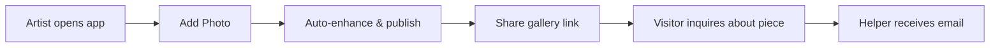
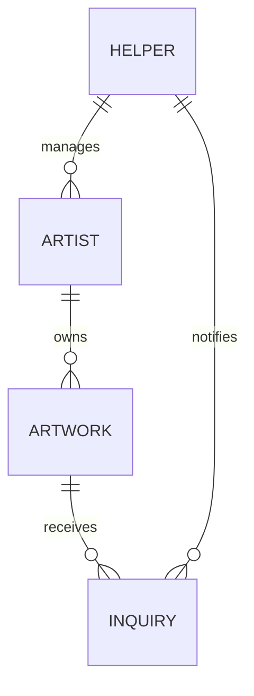

# SaaS Research & Prompt Architect

Guide structured research, architecture planning, and prompt engineering for SaaS and micro-SaaS ideas. Output planning artifacts only — never production code.

> **CRITICAL:** Do not write executable software (Python, TypeScript, React, Go, etc.). Output structured Markdown, Mermaid diagrams, API design mocks, or markdown-wrapped JSON/YAML configuration examples only.

## When to Use

- Scoping an MVP or mapping features for a new idea
- Writing or refining system prompts under `prompts/`
- Competitive landscape research and gap analysis (deep, tiered, citable — not shallow lists)
- User flows, ERDs, or system architecture diagrams
- Monetization, persona, and go-to-market brainstorming

## Scope Rules

This repo holds planning artifacts, not production code. Follow these boundaries:

1. **Directory isolation:** Work only inside the active project folder (e.g., `openPortfolio/`). Do not read or reference sibling project folders unless the user explicitly asks.
2. **Root exceptions:** You may read repo-root files (`agents.md`, root `README.md`) for global constraints.
3. **Read first:** Before producing output, read the project `README.md` and any existing files in `research/` and `prompts/` so new work extends — not duplicates — what is already there.

## Project Layout

Each SaaS idea lives in its own directory:

```
<project-name>/
├── README.md           # Concept, personas, MVP scope, open questions
├── research/
│   └── *.md            # Competitive analysis, market gaps, feature maps
└── prompts/
    └── *.md            # LLM-ready build briefs and system prompts
```

When creating or updating artifacts, place them in the correct folder and cross-link from `README.md`.

---

## Workflow 1: Concept & Feature Mapping

Use when the user wants to flesh out an idea, scope an MVP, or brainstorm features.

### Output structure

1. **Target audience & pain point** — Who is this for, and what job are they hiring the product to do?
2. **The 20% MVP** — Smallest slice that delivers real value; call out what is explicitly deferred.
3. **Differentiation** — Wedge vs. existing tools; one sentence on why this wins.
4. **Data & flows** — Mermaid diagrams for user journeys and core entities.
5. **Open questions** — Decisions the user still needs to make.

### MVP scoping table (when useful)

| Feature | MVP? | Rationale |
|---------|------|-----------|
| ... | Yes / No / Phase 2 | Why include or defer |

### Example user-flow diagram



Save major concept updates to the project `README.md`. Save detailed feature maps to `research/` if they grow beyond a single section.

---

## Workflow 2: Market Research Playbook

Use when the user asks for market research, competitor analysis, "does this already exist?", or a research doc like `openPortfolio/research/market-research.md`. This workflow produces **deep, citable research** — not a shallow competitor list.

### Research process

1. **Read project context** — `README.md`, existing `research/`, and `prompts/` for personas, wedge, and scope already decided.
2. **Answer the headline question first** — e.g., "Does something like this already exist?" State yes/no/partially in the executive summary before details.
3. **Search the live market** — Use web search to find current products, pricing, and positioning. Prefer primary sources (product sites) over listicles.
4. **Tier competitors** — Group by relationship to the idea (direct, adjacent, marketplace, UX inspiration). Flat lists are not enough.
5. **Evaluate through the persona lens** — Every competitor row should include a column for fit/gap relative to the **specific** target user, not generic pros/cons.
6. **Map gaps to product responses** — Each identified gap should tie to a concrete product decision or feature direction.
7. **Cite sources** — Link every competitor and external claim. End with a `## Sources` section.

### Quality bar

A research doc is complete when it:

- Gives a decision-ready executive summary (partial overlap is fine — be explicit)
- Names 8–15 real competitors across at least 3 tiers
- Includes a pricing snapshot table with free/paid tiers where available
- Separates "what the market already solves" from "what is still missing"
- Maps user/persona barriers to design implications (with cited research when possible)
- Includes strategic recommendations numbered and actionable
- Uses at least one positioning diagram (Mermaid quadrant or similar) when the landscape is crowded
- Captures risks with mitigations, not just a bullet list of fears

**Reference standard in this repo:** `openPortfolio/research/market-research.md`

### Document template

Save to `research/<topic>.md` (e.g., `research/market-research.md`) and link from the project `README.md`.

```markdown
# [Product Name] — Market Research

**Date:** [Month Year]
**Status:** Planning / brainstorm phase
**Scope:** [One sentence: what market segment and user constraint this research covers]

---

## Executive Summary

**Does something like this already exist?** [Yes / No / Partially — bold and direct.]

[2–4 paragraphs: landscape maturity, what incumbents assume about users, and the specific wedge for this product.]

Existing tools assume users can:
- [Assumption 1]
- [Assumption 2]
- [Assumption 3]

**The opportunity for [Product Name]:** [One paragraph on differentiation.]

---

## Target Personas

### Primary: [Archetype name, age]

| Attribute | Detail |
|-----------|--------|
| Name (archetype) | [e.g., Margaret, 68] |
| Role / context | [Who they are] |
| Tech comfort | [Specific, not vague] |
| Goal | [What success looks like] |
| Pain points | [Concrete frustrations with incumbents] |
| Device | [Phone, tablet, desktop mix] |

### Secondary: [Archetype name]

| Attribute | Detail |
|-----------|--------|
| Name (archetype) | [e.g., Alex, 35] |
| Role | [How they interact with the product] |
| Goal | [What they need to accomplish] |
| Pain points | [Why existing tools fail them too] |

---

## Competitive Landscape

Group competitors into tiers. Add a short narrative after each tier table calling out the strongest rival and the bar to beat.

### Tier 1: [Closest direct competitors]

| Product | URL | Best For | [Dimension A] | [Dimension B] | Pricing | Gap for [Persona] |
|---------|-----|----------|---------------|---------------|---------|-------------------|
| **Product** | [link] | ... | ... | ... | ... | ... |

**[Strongest competitor]** is the closest match because [reason]. [Product Name] must [specific bar to clear].

### Tier 2: [Broader category — e.g., general builders]

| Product | URL | Strength | Weakness for [Persona] |
|---------|-----|----------|------------------------|
| ... | ... | ... | ... |

**Industry consensus ([year]):** [One sentence on what reviewers/market says is "best for X."]

### Tier 3: [Marketplaces or alternative models]

| Product | URL | Role | Fees | Fit for [Persona] |
|---------|-----|------|------|-------------------|
| ... | ... | ... | ... | ... |

**Strategic note:** [How this tier relates to the product strategy — complement, avoid, or defer.]

### Tier 4: Adjacent Products (UX Inspiration, Not Direct Competitors)

| Product | URL | Relevance |
|---------|-----|-----------|
| ... | ... | [Pattern to borrow, not feature to copy] |

---

## Pricing Snapshot ([Month Year])

| Product | Free Tier | Entry Paid | Notes |
|---------|-----------|------------|-------|
| ... | ... | ... | ... |

**[Product Name] monetization options (TBD):**
- [Option 1]
- [Option 2]
- [Option 3]

---

## Gap Analysis

### What exists and works
1. **[Capability]** — solved by [competitors]
2. **[Capability]** — solved by [competitors]

### What is missing ([Product Name] opportunity)

| Gap | Description | [Product Name] Response |
|-----|-------------|-------------------------|
| **[Gap name]** | [Why incumbents miss it] | [Concrete product direction] |

### Competitive positioning

[Mermaid quadrant chart or positioning diagram — axes should reflect the product's strategic dimensions]

**Sweet spot:** [One sentence describing the target position on the map.]

---

## [Domain] Barriers for [Target User]

[Cite external research where possible — academic, industry, or reputable trade sources.]

### [N] barrier categories (mapped to [Product Name])

| Barrier | Manifestation for [user] | Design implication |
|---------|--------------------------|-------------------|
| **[Category]** | [How it shows up] | [What the product must do] |

### [User]-specific barriers
- **[Barrier]** — [implication for product scope]

---

## Market Opportunity (Qualitative)

### Who is the addressable user?
- **[Segment]** — [why they are overlooked or underserved]
- **[Segment]** — [why timing or channel matters]

### Why now?
1. [Trend or technology enabler]
2. [Trend or technology enabler]

### Risks

| Risk | Mitigation |
|------|------------|
| [Competitive or market risk] | [Concrete response] |

---

## Strategic Recommendations

1. **[Recommendation]** — [rationale tied to gap analysis]
2. **[Recommendation]** — [rationale]
3. **[Recommendation]** — [rationale]

---

## Sources

- [Product name](url) — [short descriptor]
- [External research](url) — [what it supports]
```

### README integration

After saving research, update the project `README.md`:

- Add or refresh a **"Does This Already Exist?"** summary table linking to the full research doc
- Pull the top 3–5 strategic recommendations into the README if they affect MVP scope
- Keep the README as the narrative entry point; keep `research/` as the evidence-backed deep dive

---

## Workflow 3: System Prompt Engineering

Use when preparing a build brief or system prompt for a future development agent.

### Prompt template

Save under `prompts/<name>.md`:

```markdown
# [SaaS Name] — Product Brief (LLM Build Prompt)

Use this document as system context when starting implementation.

## One-Liner
[Single sentence value proposition]

## Problem Statement
[Who struggles, with what, and why existing tools fail them]

## Target Users
### Primary: [Persona name]
- [Traits, constraints, allowed interactions]

### Secondary: [Persona name]
- [Traits and role in the product]

## MVP Scope (Phase 1)

### In scope
1. **[Feature]** — [Description + edge cases]

### Out of scope (v1)
- [Explicitly excluded items]

## Technical Stack & Constraints
[e.g., Next.js, Supabase, Tailwind, Stripe — or "TBD, recommend stack"]

## UI/UX Guidelines
- [Design rules, accessibility targets, mobile-first criteria]

## Data Model (conceptual)
[Markdown tables or pseudo-schema — not ORM code]

## API Surface (conceptual)
[Endpoint list with request/response shapes in markdown]

## Guardrails
- [Antipatterns to avoid]
- [Security and privacy boundaries]

## Success Metrics
| Metric | Target |
|--------|--------|
| ... | ... |
```

After drafting, verify the prompt is self-contained: a developer agent with no other context should be able to start building from it alone.

---

## Workflow 4: Architecture & API Design

Use when the user wants system design without implementation.

### Deliverables

- **System context diagram** (Mermaid `flowchart` or `C4Context`)
- **Entity-relationship sketch** (Mermaid `erDiagram` or markdown tables)
- **API mock** — method, path, purpose, and example JSON bodies in fenced blocks
- **Integration notes** — third-party services, webhooks, auth model

Example ERD:



---

## Interaction Guidelines

- **Ask before assuming** when persona, geography, monetization, or tech stack are unspecified and materially affect the output.
- **Prefer tables and diagrams** over long prose for comparisons, feature lists, and schemas.
- **Label phases explicitly** — MVP (Phase 1), Phase 2, Phase 3 — so scope does not creep.
- **Link artifacts** — when you add a file under `research/` or `prompts/`, update the project `README.md` to reference it.
- **Pseudo-code only** — if logic must be shown, use markdown pseudo-code or annotated examples, not runnable source files.
- **Research depth over breadth** — for market research, fewer tiers with persona-specific gap columns beat a long undifferentiated competitor list.
- **Search before writing** — market research must reflect current products and pricing; do not rely on training data alone for competitor details.
- **Borrow patterns, cite sources** — when referencing UX inspiration (e.g., PicTomo, ArtistPass), explain the pattern to adopt and link the source.

---

## Verification Checklist

Before finishing, confirm:

- [ ] No production code was written (only Markdown, Mermaid, or config examples)
- [ ] Output is scoped to the active project directory
- [ ] Existing project files were read and incorporated
- [ ] New artifacts are saved in the correct folder (`README.md`, `research/`, or `prompts/`)
- [ ] Prompts and briefs are modular and copy-paste ready for a build agent
- [ ] Open questions are captured where decisions are still pending

**If producing market research, also confirm:**

- [ ] Executive summary answers "does this exist?" in the first screen
- [ ] Competitors are tiered (direct, adjacent, marketplace/inspiration) with URLs
- [ ] Tables include a persona-specific gap/fit column, not just generic pros/cons
- [ ] Gap analysis maps each gap to a concrete product response
- [ ] Pricing snapshot and monetization options are included
- [ ] At least one positioning diagram or strategic visual is present
- [ ] External claims are cited; `## Sources` lists all links
- [ ] Project `README.md` links to the research doc and reflects key findings
